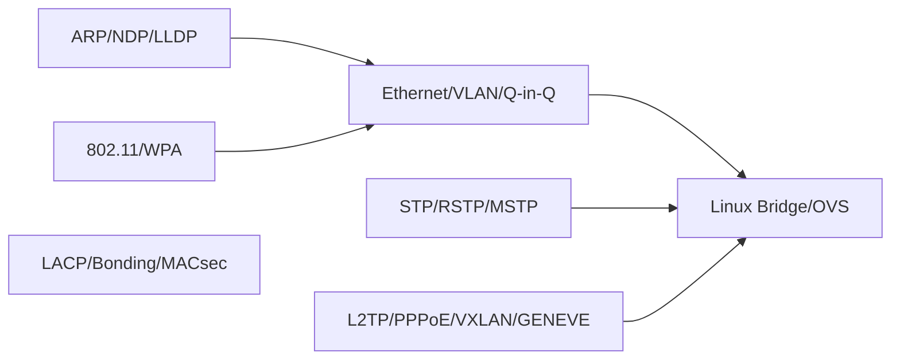

### All Layer 2 (Data Link Layer) Protocols

These protocols operate at **OSI Layer 2** and are processed by the **Linux kernel networking stack**, NIC drivers, or switching components (bridge, OVS).

### Ethernet & LAN Technologies

* **Ethernet (IEEE 802.3)**
* [**MAC addressing**](design/system-design/load_balancer/mac_address.md)
* **VLAN – IEEE 802.1Q**
* **Q-in-Q – IEEE 802.1ad**
* **Provider Backbone Bridging – IEEE 802.1ah**

### Switching & Spanning Tree

* **STP (Spanning Tree Protocol – 802.1D)**
* **RSTP (Rapid Spanning Tree – 802.1w)**
* **MSTP (Multiple Spanning Tree – 802.1s)**
* **SPB (Shortest Path Bridging – 802.1aq)**

### Link Aggregation & Redundancy

* **LACP / 802.1AX (Link Aggregation)**
* **Bonding (Linux bonding driver)**
* **VRRP** (Often treated L3/L2 hybrid)

### Wireless L2 Protocols

* **Wi-Fi (IEEE 802.11 a/b/g/n/ac/ax)**
* **WPA/WPA2/WPA3 (Security at L2)**
* **EAPOL (Authentication frames)**

### Control Protocols (L2 Signaling)

* **ARP (Address Resolution Protocol)**
* **NDP (Neighbor Discovery for IPv6)**
* **LLDP (Link Layer Discovery Protocol)**
* **CDP (Cisco Discovery Protocol)**
* **L2CP (Link Layer Control Protocol)**
* **PAUSE Frames (802.3x Flow Control)**

 
### ARP (Address Resolution Protocol)

Resolves IPv4 addresses to MAC addresses on a LAN.
The Linux kernel sends ARP Requests and caches Replies in the ARP table for fast L2→L3 mapping.

### NDP (Neighbor Discovery Protocol)

IPv6 replacement for ARP using ICMPv6 messages.
Handles address resolution, router discovery, neighbor reachability, and prefix advertisement.

### LLDP (Link Layer Discovery Protocol)

Vendor-neutral Layer-2 discovery protocol (IEEE 802.1AB).
Devices send LLDP frames containing identity, capabilities, and port details for topology visibility.

### CDP (Cisco Discovery Protocol)

Cisco-proprietary equivalent of LLDP.
Provides device information (ID, IP, port, model) for troubleshooting Cisco networks.

### L2CP (Layer 2 Control Protocols)

Special class of control protocols carried inside slow protocol frames (EtherType 0x8809).
Includes LACP, STP, LLDP, PAUSE, and others; switches treat them specially and never forward them.

### PAUSE Frames (IEEE 802.3x Flow Control)

Layer-2 mechanism that slows down traffic to prevent NIC or switch buffer overflow.
Receiver sends a PAUSE frame asking the sender to halt transmission for a specified time.

 

## L2 Tunneling / Encapsulation

* **L2TP (Layer 2 Tunneling Protocol)**
* **PPPoE (Point-to-Point Protocol over Ethernet)**
* **VXLAN** (Encapsulates L2 but runs over L4)
* **GENEVE** (L2 over UDP)
* **NVGRE** (L2 over GRE)
* **MACsec (802.1AE)**

### Bridging & Virtualization Protocols

* **Linux Bridge** (Switching at L2 in kernel)
* **Open vSwitch (OVS)**
* **FDB (Forwarding Database)**
* **EVPN (MAC learning & control-plane for overlays)**

### WAN / Telco L2 Protocols

* **ATM (Asynchronous Transfer Mode)**
* **Frame Relay**
* **MPLS-TP (Transport Profile)**
* **HDLC**
* **PPP (Point-to-Point Protocol)**
* **Metro Ethernet E-LINE/E-LAN services**

### Mermaid Diagram (L2 Protocol Groups)

If you want, I can also list **which Linux kernel modules implement each protocol** or explain **L2 forwarding path inside the kernel (bridge + FDB lookup)**.

