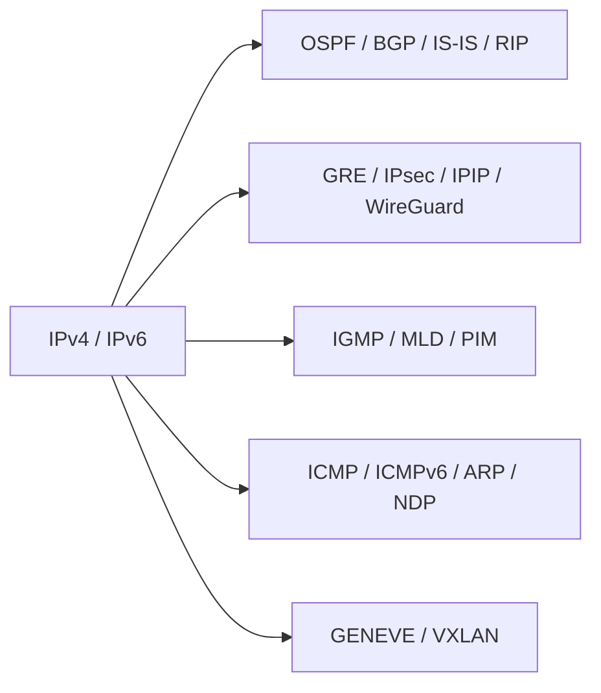

### All Layer 3 (Network Layer) Protocols

These are protocols that operate at **OSI Layer 3** and handled by the **Linux kernel IP stack** for forwarding, routing, or control.

### Core L3 Protocols

* **IPv4 (Internet Protocol v4)**
* **IPv6 (Internet Protocol v6)**

### Routing Protocols (Control Plane – run in user space)

* **OSPFv2 / OSPFv3**
* **IS-IS**
* **RIP / RIPng**
* **BGP**
* **EIGRP** (Linux support via FRRouting plugin)

### Tunneling / Encapsulation (L3-over-L3, handled partly by kernel modules)

* **GRE (Generic Routing Encapsulation)**
* **IP-in-IP**
* **SIT (IPv6 over IPv4)**
* **IPsec (ESP/AH)**
* **WireGuard**
* **GIF (Generic Tunnel Interface)**

### Multicast L3 Protocols

* **IGMP (IPv4 multicast membership)**
* **MLD (IPv6 multicast membership)**
* **PIM-SM / PIM-DM**
* **DVMRP**

### Address Resolution / Control (Not pure L3 but works with L3)

* **ICMP (Internet Control Message Protocol)**
* **ICMPv6**
* **ARP** (Between L2 and L3)
* **NDP (Neighbor Discovery Protocol for IPv6)**

### L3 VPN and MPLS-Related

* **MPLS (Multiprotocol Label Switching)**
* **LDP (Label Distribution Protocol)**
* **RSVP-TE**

### Overlay Network Protocols (L3-based encapsulation for SDN)

* **GENEVE**
* **VXLAN** (UDP-based but enables L3 overlay)
* **NVGRE**

### Mermaid Diagram (L3 Protocol Groups)

If you want, I can also list **all kernel modules** that implement these protocols and how Linux processes L3 packets internally (routing decision, FIB lookup, netfilter hooks).

