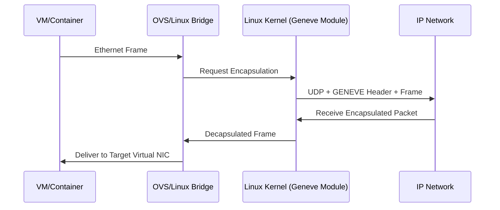
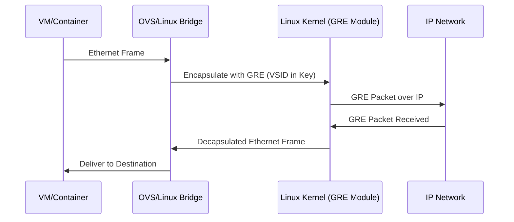

### What is GENEVE Protocol

GENEVE (Generic Network Virtualization Encapsulation) is a network tunneling/encapsulation protocol designed for software-defined data centers. It encapsulates Layer-2 frames inside UDP packets to create virtual overlays across an IP network.

### Core Purpose

Provide a flexible and extensible encapsulation format for network virtualization platforms such as OpenStack, VMware NSX, and cloud SDN systems.

### Components Involved

* **Linux Kernel Network Stack**: Processes GENEVE packets at L3/L4/L2 tunneling layers.
* **UDP Layer (Kernel)**: GENEVE uses UDP port **6081** by default.
* **Virtual Switches (OVS / Linux bridge)**: Encapsulate and decapsulate frames.
* **Geneve driver/module in Linux**: Handles tunnel creation, metadata, and parsing.
* **SDN Controller**: Supplies tunnel endpoints and optional metadata.

### How GENEVE Works

* Takes an Ethernet frame from a virtual machine or container.
* Adds a GENEVE header (with optional TLVs).
* Encapsulates inside UDP over IP.
* Sends across the physical network to the remote hypervisor.
* Remote kernel/OVS decapsulates and injects frame into target VM/namespace.

### Key Features

* Extensible TLVs (Type-Length-Value) for vendor and controller metadata.
* Decouples control plane (SDN) from data plane encapsulation.
* Support for multi-cloud and dynamic network virtualization.
* More flexible and future-proof compared to VXLAN and NVGRE.

### Encapsulation Structure

IP header → UDP header → GENEVE header → Ethernet frame (payload)

### Comparison with VXLAN

| Feature          | GENEVE                    | VXLAN                |
| ---------------- | ------------------------- | -------------------- |
| Extensibility    | High (TLVs)               | Limited              |
| Header structure | Dynamic                   | Fixed                |
| Standardization  | IETF draft                | RFC 7348             |
| Use case         | Future-proof SDN overlays | Existing DC overlays |

### Real Use Case Example

Creating a GENEVE tunnel on Linux (kernel does encapsulation):

```bash
ip link add geneve0 type geneve id 100 remote 192.168.1.20 dstport 6081
ip link set geneve0 up
```

* `ip` uses **netlink**
* Kernel loads **geneve.ko**
* Linux networking stack builds/decapsulates GENEVE headers

### Mermaid Diagram



If you want, I can also explain GENEVE header layout or compare GENEVE vs VXLAN vs GRE at kernel-level packet flow.

### What is NVGRE Protocol

NVGRE (Network Virtualization using Generic Routing Encapsulation) is a network virtualization tunneling protocol that encapsulates Layer-2 Ethernet frames inside GRE packets to create L2 overlays across an L3 IP network. It is used in SDN-based data centers to isolate tenant networks.

### Core Purpose

Provide virtual L2 segments over an IP underlay using GRE with a configurable **Virtual Subnet ID (VSID)** to support multi-tenant isolation.

### Components Involved

* **Linux Kernel GRE Module**: Performs GRE encapsulation/decapsulation.
* **Virtual Switches (OVS, Hyper-V switch)**: Forward frames into NVGRE tunnels.
* **IP Stack (Kernel Routing)**: Routes outer IP packets across the underlay.
* **SDN Controller**: Distributes NVGRE tunnel endpoints and VSIDs.
* **GRE Header (Key field)**: Stores the VSID.

### How NVGRE Works

* VM emits an Ethernet frame to virtual switch (OVS or Hyper-V switch).
* Switch encapsulates the frame in GRE.
* VSID is stored in the **GRE Key field**.
* Outer IP header carries Tunnel Endpoints (TEPs).
* The remote host decapsulates GRE and injects the original frame into the destination VM.

### Encapsulation Structure

Outer IP → GRE (Key with VSID) → Inner Ethernet Frame

### Key Features

* Uses existing GRE support in NICs and Linux kernel.
* Supports multi-tenant segmentation via VSID.
* Simpler and lighter than VXLAN/GENEVE but less flexible.
* Static header format (not extensible like GENEVE).

### NVGRE vs VXLAN vs GENEVE

| Feature            | NVGRE          | VXLAN     | GENEVE        |
| ------------------ | -------------- | --------- | ------------- |
| Encapsulation      | GRE            | UDP       | UDP           |
| Tenant ID          | VSID (GRE Key) | VNI       | VNI with TLVs |
| Header flexibility | Low            | Medium    | High          |
| Extensibility      | No             | Some      | High          |
| Widely adopted     | Moderate       | Very High | Increasing    |

### Real Use Case Example (Linux)

Configure an NVGRE tunnel (kernel GRE module does encapsulation):

```bash
ip link add gre1 type gretap remote 10.0.0.20 local 10.0.0.10 key 100
ip link set gre1 up
bridge addif br0 gre1
```

* `ip` uses **netlink**
* Kernel loads **gretap.ko**
* Packets matching the bridge domain get encapsulated with GRE Key=100
* Underlay IP routing forwards encapsulated traffic

### Mermaid Diagram



If you want, I can also explain the **GRE Key field format**, how **VSID maps to tenant networks**, or compare **NVGRE performance vs VXLAN** inside the Linux kernel.

