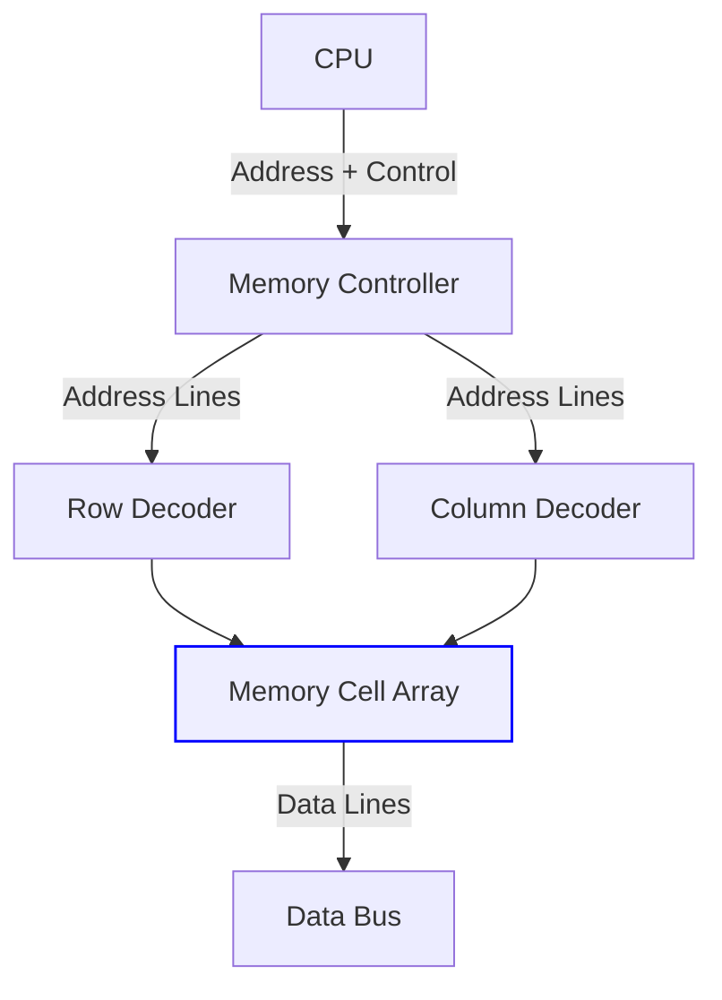

Excellent — this is one of the most fundamental yet misunderstood topics in computer architecture 💡

Let’s break down **RAM (Random Access Memory)** from both perspectives — **logical architecture** (how software and CPU *see* memory) and **physical architecture** (how memory is *actually built and wired* on hardware).

We’ll go step by step 👇

---

## 🧠 1. What Is RAM?

RAM is the computer’s **main memory** —
it temporarily stores data and instructions that the CPU needs **right now**.

* **Volatile:** loses content when power is off.
* **Random Access:** CPU can access any address in equal time (not sequential).

---

# 🧩 Logical Architecture of RAM

*(How memory looks to the CPU and software)*

From the CPU’s point of view, RAM is a **linear sequence of memory addresses** —
each identified by a **unique number** (address).

Example:

| Address | Contents (Binary) |
| ------- | ----------------- |
| 0x0000  | 01100100          |
| 0x0001  | 11101001          |
| 0x0002  | 01010100          |
| 0x0003  | 00001111          |

➡️ Each address stores **1 byte** (8 bits).

### 📘 Logical View Characteristics

1. **Address Space:**

   * Defined by CPU architecture (e.g., 32-bit = 4 GB address space, 64-bit = 16 EB).
2. **Virtual Memory:**

   * The OS and MMU (Memory Management Unit) map **virtual addresses → physical addresses**.
3. **Segmentation & Paging:**

   * Used to manage and protect memory regions.
4. **Stack, Heap, Code, Data sections:**

   * Logical divisions of memory within a process.

---

### 💡 Example (Logical View inside a Process)

```mermaid
graph TD
    A[Virtual Address Space] --> B[Text Segment (Code)]
    A --> C[Data Segment (Static Variables)]
    A --> D[Heap (Dynamic Allocation)]
    A --> E[Stack (Function Calls)]
    style A fill:#f8f9ff,stroke:#6c6cff,stroke-width:2px
```

---

# ⚙️ Physical Architecture of RAM

*(How memory is actually built, wired, and accessed)*

At the hardware level, RAM is made up of **millions (or billions)** of tiny storage cells.
Each cell stores **1 bit (0 or 1)** using electrical charge or transistor state.

---

### 🔹 1. RAM Hierarchy and Components

| Component             | Description                                                             |
| --------------------- | ----------------------------------------------------------------------- |
| **Memory Controller** | Interface between CPU and RAM; manages reads/writes and refresh cycles. |
| **Address Bus**       | Carries memory addresses from CPU to RAM.                               |
| **Data Bus**          | Carries data between CPU and RAM.                                       |
| **DRAM Chips**        | Actual memory chips where data is stored.                               |
| **DIMM Modules**      | Physical sticks inserted into the motherboard (contain DRAM chips).     |

---

### 🔹 2. Inside a DRAM Chip

Each DRAM chip has:

* **Memory cells** arranged in **rows and columns**.
* Each cell = a **capacitor + transistor** pair.
* **Row Address Strobe (RAS)** and **Column Address Strobe (CAS)** select which cell to access.

#### Simplified Diagram



Each **read/write**:

1. The controller sends address.
2. Row & column decoders locate the cell.
3. The capacitor’s charge (0 or 1) is read or modified.
4. Data is placed on the data bus.

---

### 🔹 3. Memory Hierarchy (CPU ↔ RAM ↔ Disk)

```mermaid
graph TD
    A[CPU Registers] --> B[L1 Cache]
    B --> C[L2 Cache]
    C --> D[L3 Cache]
    D --> E[Main Memory (RAM)]
    E --> F[Secondary Storage (SSD/HDD)]
    style A fill:#ffe,stroke:#fc0
    style E fill:#eef,stroke:#06f
```

* **CPU Registers:** Fastest, smallest.
* **Caches (L1–L3):** Between CPU and RAM, reduce access time.
* **RAM:** Main working memory.
* **Disk:** Large but slow.

---

# 🔬 Logical vs Physical Architecture — Side by Side

| Aspect            | Logical Architecture                         | Physical Architecture                  |
| ----------------- | -------------------------------------------- | -------------------------------------- |
| **Perspective**   | Software / CPU view                          | Hardware / Electrical view             |
| **Structure**     | Linear address space                         | Matrix of cells (rows × columns)       |
| **Unit**          | Byte (8 bits)                                | Bit cell (capacitor + transistor)      |
| **Access**        | Virtual address → physical address (via MMU) | Row/Column decoders, buses             |
| **Organization**  | Stack, heap, data, code sections             | DRAM modules, DIMMs, banks             |
| **Controlled by** | OS, MMU                                      | Memory controller, hardware logic      |
| **Failure Mode**  | Segfault / Page fault                        | Bit flips / Row hammer / Timing errors |

---

# ⚡️ Summary

* **Logical Architecture**: How the CPU and OS *see* memory → sequential addresses, divided into process regions.
* **Physical Architecture**: How memory *actually exists* → grids of electrical cells in DRAM chips connected via buses.
* The **MMU bridges** the logical and physical worlds.
* Together, they make random access possible — abstracted from hardware complexity.

---

Would you like me to include the **interaction between MMU, TLB, and caches** (how a virtual memory address becomes a physical address when accessing RAM)?
That’s the next level in understanding RAM’s logical ↔ physical translation.
